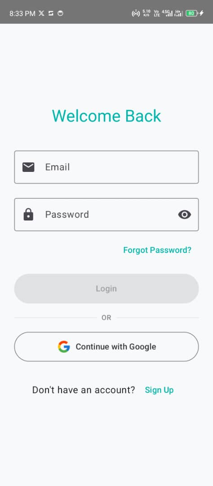
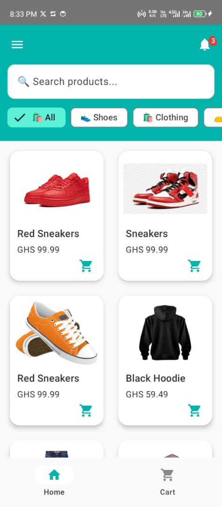
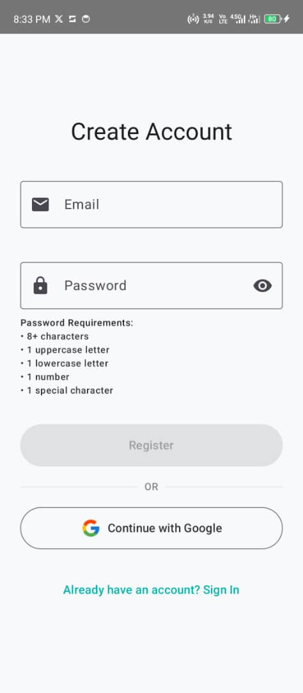
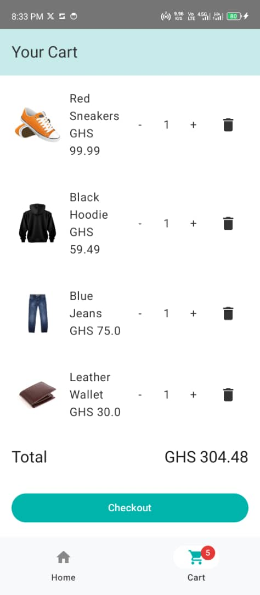
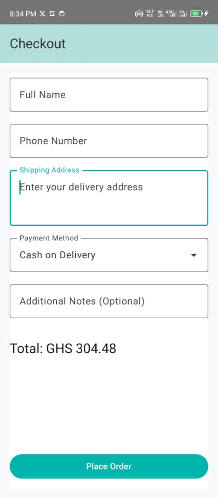

# 🛍️ ShopEase - E-commerce Android App


---

## 📖 Summary
**ShopEase** is a comprehensive e-commerce Android application built with **Jetpack Compose** and **Firebase Authentication**.  
The app provides a complete shopping experience with **user authentication, product browsing, cart management, and checkout functionality**.

---

## ✨ Key Features

### 🔑 Authentication
- Email/password login with email verification
- Google Sign-In integration
- User registration with password requirements
- Password reset functionality

### 🛒 Product Management
- Product catalog with categories
- Search functionality
- Product cards with images and details

### 🛍️ Shopping Cart
- Add/remove products from cart
- Adjust product quantity
- Real-time cart total calculation

### 💳 Checkout Process
- Shipping information collection
- Payment method selection
- Order placement and confirmation

### 🧭 Navigation
- Bottom navigation bar
- Navigation drawer
- Authentication-based routing

---

## ⚙️ Technical Implementation

- **Frontend:** Jetpack Compose for all UI components
- **State Management:** ViewModel for business logic
- **Navigation:** Navigation Compose with authentication state handling
- **Authentication:** Firebase Auth (Email & Google Sign-In)
- **Architecture:** MVVM (Model-View-ViewModel) with separation of concerns

---

## 📸 Screenshots

<p align="center">
  
  
  
</p>

<p align="center">
  
  
</p>

---

## 🚀 Getting Started

1. Clone the repository:
   ```bash
   git clone https://github.com/yourusername/ShopEase-App.git
